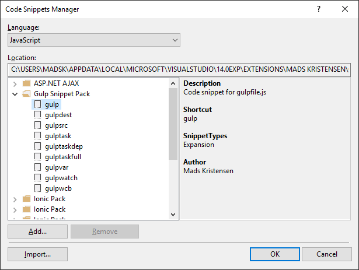

# Gulp Snippet Pack for Visual Studio

[](https://ci.appveyor.com/project/madskristensen/gulpsnippetpack)

Download this extension from the
[VS Gallery](https://visualstudiogallery.msdn.microsoft.com/9e26d1f9-1baf-4983-8c25-f5f769998d4f)
or get the
[nightly build](http://vsixgallery.com/extension/17c6719c-d92f-4bdb-a145-ea2d6dd70900/).

-----------------------------------------

A snippet pack to make you more productive working with
the Gulp task runner. 

This extension contains code snippets for Gulp from the
awesome [Gulp Snippets](https://marketplace.visualstudio.com/items?itemName=tanato.vscode-gulp)
extension for VS Code.


This extension ships a bunch of useful code snippets for
the JavaScript editor. Get an overview from the
**Code Snippet Manager** in Visual Studio located under
the **Tools** top level menu.



## Snippets

#### gulp
```
var gulp = require('gulp-name');

gulp.task("$name$", function () {
    // content
});
```

#### gulpvar
```
var gulp = require('gulp');
```

#### gulpsrc - [Docs](https://github.com/gulpjs/gulp/blob/master/docs/API.md#gulpsrcglobs-options)
```
gulp.src('scriptFiles')
  .pipe(name('file'))
```

#### gulptask - [Docs](https://github.com/gulpjs/gulp/blob/master/docs/API.md#gulptaskname-deps-fn)
```
gulp.task('name', function() {
    // content
});
```

#### gulptaskdep - [Docs](https://github.com/gulpjs/gulp/blob/master/docs/API.md#gulptaskname-deps-fn)
```
gulp.task('name', ['tasks'], function() {
    // content
});
```

#### gulpdest - [Docs](https://github.com/gulpjs/gulp/blob/master/docs/API.md#gulpdestpath)
```
.pipe(gulp.dest('folder'));
```

#### gulpwatch - [Docs](https://github.com/gulpjs/gulp/blob/master/docs/API.md#gulpwatchglob-opts-tasks)
```
gulp.watch('file', ['tasks']);
```

#### gulpwcb - [Docs](https://github.com/gulpjs/gulp/blob/master/docs/API.md#gulpwatchglob-opts-cb)
```
gulp.watch('file', function(event) {
  console.log(' File '+event.path+' was '+event.type+', running tasks...');
});
```

#### gulptaskfull
```
gulp.task('name',['tasks'], function() {
    gulp.src('files')
        .pipe(plugin())
        .pipe(gulp.dest('folder'));
});
```

## Contribute
Check out the [contribution guidelines](.github/CONTRIBUTING.md)
if you want to contribute to this project.

For cloning and building this project yourself, make sure
to install the
[Extensibility Tools 2015](https://visualstudiogallery.msdn.microsoft.com/ab39a092-1343-46e2-b0f1-6a3f91155aa6)
extension for Visual Studio which enables some features
used by this project.

## License
[Apache 2.0](LICENSE)